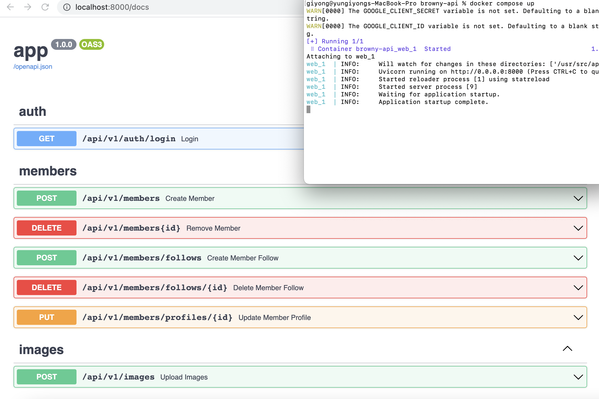

# browny-api

## Basic installation
```bash
python3.7, docker, docker-compose
```

## Run local docker-composer and share workspace with local filesystem
```bash
docker-compose up
# OR
docker compose up
```



------------------------
## ETC

## Build for deploy

```bash
docker build -t browny/browny-api .
```

## Run local docker

```bash
docker run -p 8000:8000 --name lastorder_api --env-file .env.local browny/browny-api
```

## Run local runserver

configure local venv and install dependencies 
```bash
python -m venv venv
source venv/bin/activate
pip install -r requirements.txt
```
